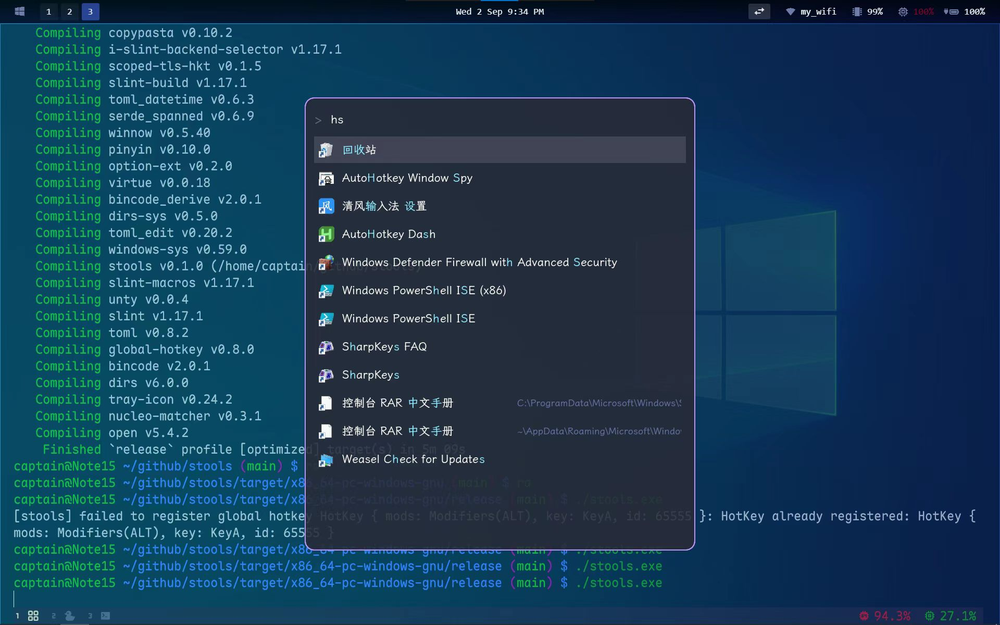

# stools

A minimal, Fuzzel-style application launcher built with [Slint](https://slint.dev/).

English | [简体中文](README.zh-CN.md)

<p align="center">
  
</p>

- **Fixed, centered window** — borderless, no dynamic re-layout.
- **Fuzzy + pinyin matching** (`nucleo-matcher` + `pinyin`), heteronyms included,
  so `wyyyy` matches 网易云音乐.
- **Apps and binaries** — `.desktop` entries plus executables from common PATH
  directories. Binaries rank below apps and show their directory as a subtitle.
- **MRU history** — recent and frequent items float to the top
  (`~/.local/share/stools/history.json`).
- **Linux** — single-shot; the index is cached under `~/.cache` for a near-instant
  start. No tray, no built-in hotkey: your WM binds the key.
- **Windows** — tray daemon with a global hotkey (default **Alt+A**).
- macOS is not supported.

## Install

- **Arch Linux** — from the AUR: `yay -S stools-bin` (or `paru -S stools-bin`).
- **Other Linux / Windows** — download the prebuilt binary from
  [GitHub Releases](https://github.com/cap153/stools/releases).
- **From source** — `cargo build --release` (→ `target/release/stools`).

## Linux setup

stools is stateless: bind a key, and let the WM float and centre the window.

```ini
# ~/.config/sway/config
for_window [app_id="stools"] floating enable
for_window [app_id="stools"] move position center
bindsym $mod+space exec stools
```

| Key | Action |
|---|---|
| `↑` / `↓` | Move selection |
| `Enter` | Launch and exit |
| `Esc` | Exit |
| typing | Live fuzzy / pinyin filtering; matched characters are highlighted |

The first run scans and writes a cache; later runs load it instantly and refresh
it in the background, so newly installed apps appear on their own.

## Windows

Runs as a background tray daemon:

- **Alt+A** (or left-click the tray icon) summons the window.
- **Esc** hides it; summoning again selects the typed text.
- Tray menu: **Show**, **Reload config**, **Show config folder**, **Quit**.

Start Menu `.lnk` files are scanned, launching goes through the shell, and icons
are read out of the shell (`.lnk`, `.exe`, `.url`). The `path` directories from
the config are scanned for executables exactly as on Linux.

## System actions (`extras/`)

stools has no plugin system. Drop ready-made shortcuts into a scanned directory
instead — no restart needed, the index refreshes in the background.

- **Linux** — `cp extras/linux/*.desktop ~/.local/share/applications/`
  (power off, reboot, lock screen, empty/open trash; bilingual `Name` /
  `Name[zh_CN]`, so `关机` and `poweroff` both match).
- **Windows** —
  `powershell -ExecutionPolicy Bypass -File extras/windows/install_shortcuts.ps1`
  (creates Start Menu shortcuts under `stools Commands`).

## Configuration

One `config.toml`, created on first run with a commented default:

| Platform | Path |
|---|---|
| Linux | `~/.config/stools/config.toml` |
| Windows | `%APPDATA%\stools\config.toml` |

Every key is optional — delete the file to restore the built-in Dracula theme. A
parse error is printed to `stderr` and the defaults are used, so a broken config
never blocks startup.

```toml
path = ["$HOME/.cargo/bin"]      # extra scan dirs (~, $VAR, %VAR% expanded)

[keybindings]                    # no modifier
tab = "down"
esc = "close"                    # Linux: quit / Windows: hide
Return = "execute"
Up = "up"
Down = "down"

[keybindings.shift]
tab = "up"

[keybindings.alt]
a = "stools"                     # summon (Windows global hotkey)

[theme]                          # Fuzzel RRGGBBAA colours
background = "282a36dd"
text = "f8f8f2ff"
prompt = "586e75ff"              # the ">" prompt
match = "8be9fdff"               # matched characters
selection-match = "8be9fdff"     # matched characters in the selected row
selection = "44475add"
selection-text = "f8f8f2ff"
border = "bd93f9ff"
font = ["ComicShannsMono Nerd Font", "LXGW WenKai GB Screen"]
```

**Search paths** — `path` extends the built-in set (`~/.local/bin`,
`/usr/local/bin`, `/usr/bin`, `/bin`, `/usr/sbin`, `/sbin`,
`/home/linuxbrew/.linuxbrew/bin`) and is scanned for `.desktop` files too
(Windows: `.exe`/`.bat`/`.cmd`/`.ps1`/`.lnk`). `~`, `$VAR`, `%VAR%` are expanded,
and missing or duplicate directories are dropped. Command-line arguments are
added on top:

```sh
stools "$HOME/.zvm/bin" "/home/linuxbrew/.linuxbrew/bin"
```

Changing `path` invalidates the cache, so the next launch rescans instead of
serving stale results. Long subtitles are shortened to `head/.../tail`; the full
path scrolls while the row is selected.

**Keybindings** — actions are `up`, `down`, `execute`, `close` and `stools`. The
table name is the modifier set: `[keybindings]`, or any combination of `ctrl` /
`alt` / `shift` / `super` (`win`/`meta`/`cmd`) joined by `_` or `+` (quote it when
using `+`). Key names are case-insensitive and accept XKB spellings (`Return`,
`Escape`, …) and the usual aliases (`enter`, `esc`, …).

**Theme** — Fuzzel's `RRGGBBAA` notation (a leading `#` and the `RGB`/`RGBA`/
`RRGGBB` forms also work), so Fuzzel themes paste in as-is. `font` is a priority
list: the first installed family wins, with system fallback for missing glyphs
(CJK in a Latin mono font, say).

## Project layout

```
build.rs               compiles the .slint UI
ui/launcher.slint      UI definition
assets/                icon.svg + generated icon.png / icon.ico
tools/build_icon.py    regenerates the icons from assets/icon.svg
extras/                example system actions (linux .desktop / windows .ps1)
src/
  main.rs              platform dispatch
  launcher.rs          shared Slint model helpers
  core/                config, keybind, theme, matcher, model, indexer,
                       history, search, i18n, path_utils
  platform/            linux.rs, windows.rs (+ windows_icon.rs for shell icons)
```

## Debugging

```sh
STOOLS_DEBUG=1 stools
# [stools] load=89.4µs new=26.4ms model=37.1ms show=46.2ms apps=159
# [stools] search-rebuild=48.2µs n=10
```

`load` = index load (cache hit or full scan), `new` = Slint/GPU init, `model` /
`show` = build the first rows and show the window, `search-rebuild` = per
keystroke re-rank (`n` = matches).

## Tests

```sh
cargo test
```

## License

MIT — see [LICENSE](LICENSE).
